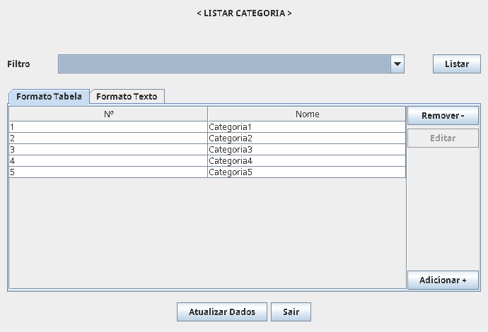
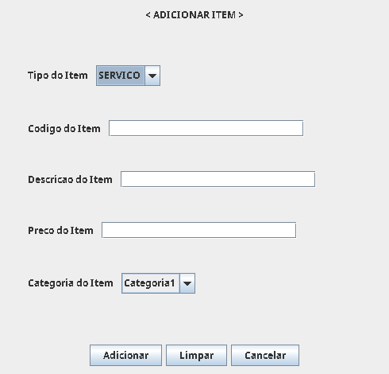

# Oficina da Concessionária de Veículos

É um sistema para gerenciar uma oficina de veículos, permitindo registrar clientes, 
veículos, funcionários, categoria, itens e a ordem de serviços. O software foi escrito
em Java utilizando o Swing para a interface gráfica.

## Screenshots

### Tela Principal

### Adicionar um Cliente

### Listar Clientes Cadastrados

### Adicionar Funcionário

### Listar Funcionários Cadastrados

### Adicionar Veículos

### Listar Veículos Cadastrados

### Adicionar Categoria

### Listar Categorias Cadastradas

### Adicionar Item

### Listar Itens Cadastrados

### Adicionar Ordem de Serviço 

### Listar Ordem de Serviços Cadastradas

### Adicionar Item à Ordem de Serviços

### Finalizar a Ordem de Serviço

